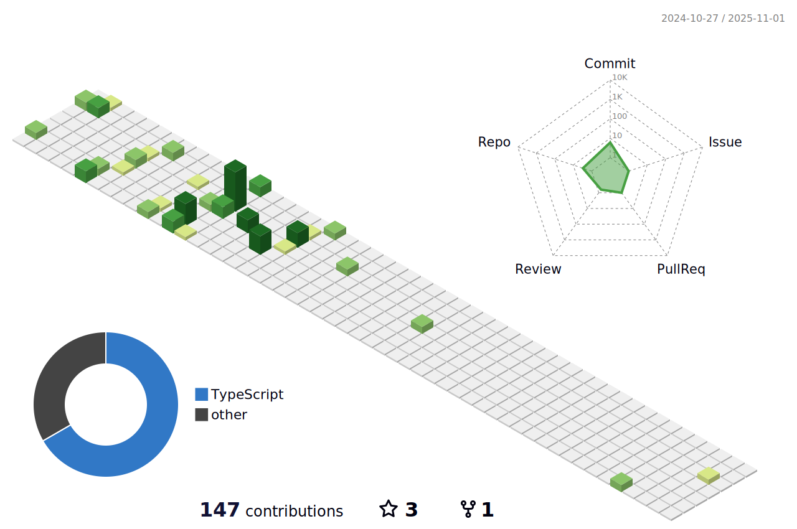

# prestonButton

<h1 align="center">Hi, I'm Preston</h1>
<h3 align="center">A frontend developer from the United States</h3>

 I'm a react developer working towards my Bachelors in Computer Science at Villanova University

<h3 align="left">Connect with me, I'm willing to work:</h3>

  
  
  
  
  

<h3 align="left"> My Languages and Tools:</h3>

  
  
  
   
  
  
   
  
      
     

  

<!-- these graphics do really sometimes have trouble may need fixing -->

  
   

<!-- this can stay commented 

  
&nbsp;

  

  
  <!--

-->

<!-- 

-->
